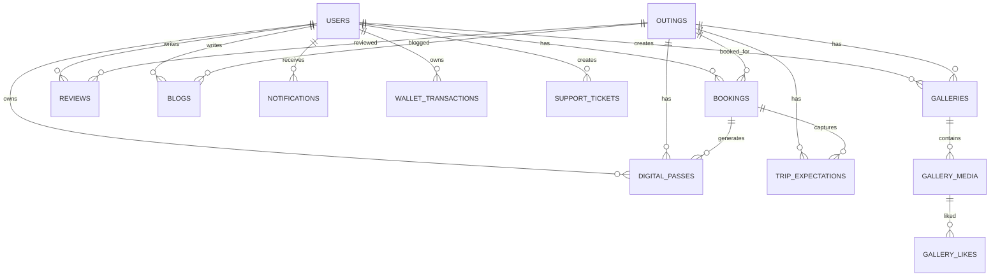
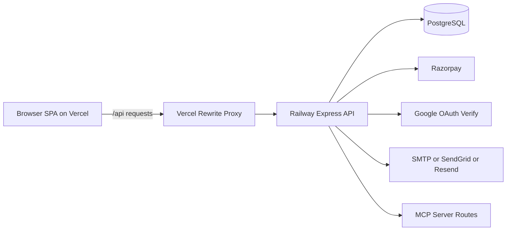
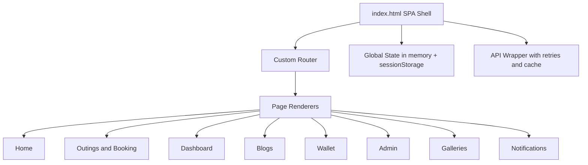
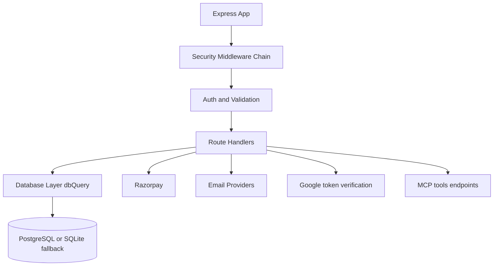
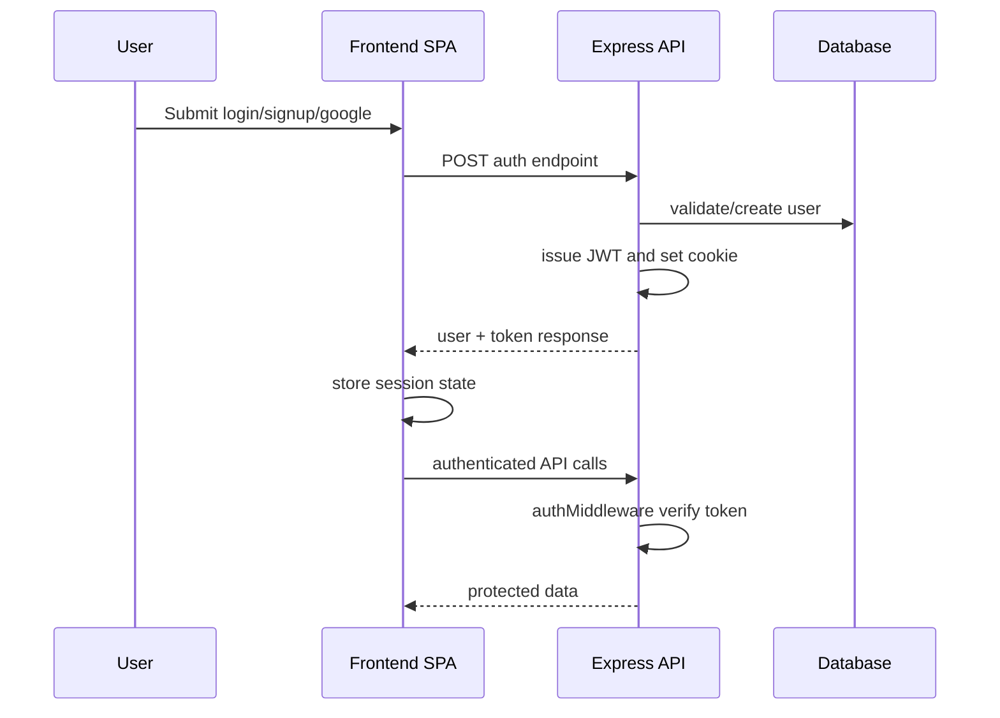
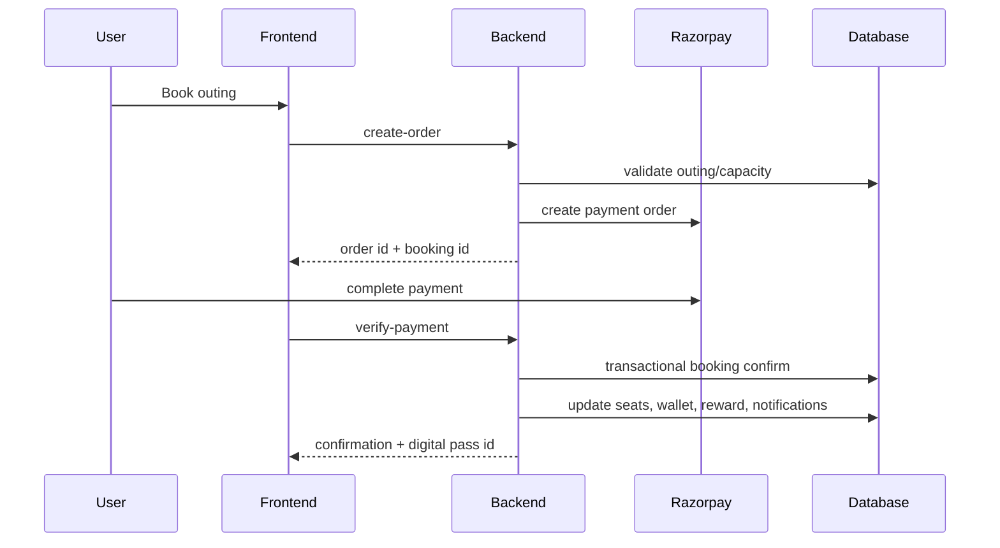

# VIBES@Outing - Full Technical Architecture Analysis

Date: June 15, 2026
Scope: Frontend, Backend, Database, Security, Performance, Infrastructure, Stability, Roadmap

---

## 1. Executive Summary

Application name:
VIBES@Outing

Purpose:
A GenZ-focused group travel and outings platform for browsing curated trips, booking with token payment, managing wallet rewards, sharing reviews/blogs, and handling post-booking operations (digital passes, notifications, support, galleries).

Overall architecture type:
- Hybrid split architecture (Production):
  - Static SPA frontend served on Vercel
  - Node.js Express API served on Railway (API-only mode)
  - PostgreSQL database on Railway
- Monolith-capable mode (Local/dev):
  - Express can also serve static frontend when API_ONLY is unset

Technology stack overview:
- Frontend:
  - Vanilla HTML/CSS/JavaScript single-file SPA
  - Browser APIs, sessionStorage-based client state
  - Razorpay Checkout JS, Google Identity Services, Google Analytics, Font Awesome
- Backend:
  - Node.js + Express
  - Security middleware: Helmet, CORS, HPP, rate limiting, cookie parser, compression
  - Auth: JWT + optional httpOnly cookie transport
  - Validation: express-validator
  - Integrations: Razorpay, SMTP/SendGrid/Resend via nodemailer/fetch, Google token verification
- Data:
  - PostgreSQL primary runtime
  - SQLite compatibility fallback for local mode
  - Runtime migrations implemented directly in server startup

Deployment architecture:
- Frontend: Vercel static deployment with SPA rewrite
- Backend: Railway web service
- Database: Railway PostgreSQL
- API proxy: Vercel rewrite from /api/* to Railway backend

Third-party integrations:
- Razorpay (payments, wallet recharge)
- Google Identity Services + google-auth-library (Google login)
- SMTP/SendGrid/Resend (email workflows)
- Google Analytics (gtag)
- MCP SDK (Model Context Protocol server mounted on Express)

---

## 2. Frontend Analysis

### Framework and Libraries

Frontend framework:
- No React/Vue/Angular framework. Custom Vanilla JS SPA in a single index file.

UI libraries:
- Font Awesome for icons
- Google Fonts

State management solution:
- In-memory globals and sessionStorage.
- No Redux/Zustand/MobX.

Routing solution:
- Custom client router using navigate function, History API, hash fallback, and URL path parsing.

Form handling libraries:
- None. Native form handling + custom validation logic.

Authentication libraries:
- Google Identity Services client SDK
- Custom JWT/session handling in frontend code

### Frontend Folder Structure

Actual frontend structure:

- public/
  - index.html (entire SPA app: markup, styles, logic)
  - manifest.json
  - sw.js
  - blur-placeholders.json
  - icons/
  - outing_pic/

Observations:
- Pages/components/layouts/hooks/contexts/services/utilities are not separated into folders.
- Architecture is single-file UI + logic coupling.
- This increases development speed initially, but creates long-term maintainability and testing risk.

Conceptual mapping inside index.html:
- Pages: home, outings, outing detail, dashboard, blogs, admin, wallet, wishlist, notifications, galleries, legal/support pages.
- Components: generated as template strings and inline event handlers.
- Services: unified api and _apiAttempt functions.
- Utilities: sanitize helpers, slug normalization, SEO helpers, cache helpers.

### Routing

Primary route modes:
- Path-based:
  - /
  - /outings
  - /outings/:slug
  - /blogs
  - /blogs/:slug
  - /wallet
  - /dashboard
  - /wishlist
  - /notifications
  - /galleries
  - /recommendations
  - /admin
  - legal/support/static informational pages
- Hash fallback:
  - #page style used for some internal routes

Public routes:
- home, outings list/detail, blogs list/detail, informational pages

Protected routes (client-guarded + backend auth enforced):
- dashboard
- wallet
- notifications
- recommendations
- user galleries
- booking/payment actions
- submit suggestion/review/blog

Admin routes:
- admin dashboard and all moderation/ops screens

Dynamic routes:
- outing-slug route
- blog slug route
- gallery detail route

Redirect logic:
- On 401 in primary calls: clear local session and keep user on current page (no forced home redirect).
- On invalid/legacy outing hashes: migration to slug route.

Navigation flow:
- navigate function with internal page switch
- pushState plus popstate listener
- resolvePageFromUrl for deep links and refresh survival

### State Management

Global state:
- currentUser
- authToken
- outings
- currentPage
- wishlistItems
- bookingWalletBalance
- API cache maps

Context providers / stores:
- None

Data flow architecture:
- User action -> navigate/render function -> api call -> response -> UI template re-render
- No unidirectional typed state container

### API Integration

Service layer:
- Single api wrapper with:
  - timeout control
  - retries for timeout/network and selected server statuses
  - 429 retry with Retry-After support
  - in-flight GET dedupe
  - short-lived GET cache
  - mutation cache invalidation

Error handling:
- Centralized client error log function
- window error + unhandledrejection hooks
- toast-based user feedback

Retry mechanisms:
- Exponential backoff with jitter
- Status-based retries for 429, 502, 503, 504
- timeout/network retries up to max retry count

Request interceptors:
- Not formal interceptor middleware, but api wrapper injects Authorization header and credentials

### Frontend Security

Authentication flow:
- Email/password login and signup
- Google One Tap / popup credential flow
- Session maintained via sessionStorage user info and token mirror; backend also supports httpOnly cookie

Authorization flow:
- Client checks for currentUser/admin role before page render
- Server is authoritative with auth middleware and admin middleware

Token storage:
- sessionStorage token + user object
- Also cookie-based token support from backend

Session management:
- clearSession on 401 or explicit logout
- logout endpoint invoked for server-side cookie clear

XSS protection:
- Client-side escape helper and sanitized rendering in many contexts
- Server-side sanitize function and validation/escaping
- CSP present

CSRF protection:
- Backend checks mutating requests for origin/referer when relying on cookie auth without Authorization header

Key frontend security risks still present:
- Inline scripts and unsafe-inline in CSP reduce XSS hardening strength
- Token presence in sessionStorage exposes risk in severe XSS scenarios

---

## 3. Backend Analysis

### Backend Framework

Runtime environment:
- Node.js 18+ (package engine), running on Express server

Framework:
- Express 4.x

API architecture:
- REST-style route handlers in a single server file
- Function-level module boundaries, no separate controllers/services folders

Server configuration:
- trust proxy enabled
- comprehensive middleware chain for security/performance
- API rate limiters
- graceful shutdown and timeout tuning

### Backend Folder Structure

Current backend implementation shape:

- server.js (all middleware, db init, routes, business logic)
- MCP_Server/
  - mcp-server.js (MCP route mounting and tools)
- data/
  - default-outings.json
  - detailed-plans.json
- tests/
  - test_all.js
  - load_test.js

Note:
- There is no layered folder separation for controllers/routes/services/models/middleware.
- This is a major maintainability and scalability concern.

### Database Architecture

Database type:
- PostgreSQL primary
- SQLite fallback compatibility mode

Schema entities (major):
- users
- outings
- bookings
- suggestions
- reviews
- blogs
- chat_messages
- id_verifications
- password_resets
- security_logs
- notifications
- support_tickets
- wallet_transactions
- galleries
- gallery_media
- gallery_likes
- trip_expectations
- partner_applications
- digital_passes
- boarding_logs

Relationships (high-level):
- users 1:N bookings, reviews, blogs, notifications, wallet_transactions, support_tickets
- outings 1:N bookings, reviews, blogs, galleries, trip_expectations, digital_passes
- bookings -> users and outings
- galleries -> outings and users
- gallery_media -> galleries
- gallery_likes -> gallery_media and users
- digital_passes -> bookings, users, outings

Indexes:
- Multiple targeted indexes are created in startup for booking lookups, slugs, logs, notifications, galleries, passes, partner applications, expectations, etc.

Constraints:
- Unique constraints on user email, digital pass IDs/tokens, gallery likes tuple
- Rating check constraint in reviews
- Extensive foreign keys

Schema diagram:

### API Documentation

Complete API inventory (grouped):

Auth and config:
- POST /api/auth/signup
- POST /api/auth/login
- POST /api/auth/google
- POST /api/auth/logout
- POST /api/auth/forgot-password
- POST /api/auth/reset-password
- GET /api/config

Health and public:
- GET /api/health
- GET /api/public-stats
- GET /api/razorpay-key

Outings:
- GET /api/outings
- GET /api/outings/:id
- GET /api/outings/by-slug/:slug
- GET /api/outings/:id/detailed-plan
- GET /api/outings/:id/available-dates
- POST /api/outings (admin)
- PUT /api/outings/:id (admin)
- DELETE /api/outings/:id (admin)

Bookings and payments:
- POST /api/bookings/create-order
- POST /api/bookings/verify-payment
- POST /api/bookings/pay-remaining
- POST /api/bookings/verify-remaining
- POST /api/bookings (demo, non-prod)
- GET /api/bookings/:userId

Chat:
- GET /api/chat/:outingId
- POST /api/chat

Suggestions:
- POST /api/suggestions
- GET /api/suggestions
- PUT /api/suggestions/:id (admin)

Reviews:
- POST /api/reviews
- GET /api/reviews/:outingId
- GET /api/reviews/eligibility/:outingId
- POST /api/reviews/:id/helpful
- GET /api/my-reviews
- GET /api/admin/reviews (admin)
- PUT /api/admin/reviews/:id (admin)

Blogs:
- POST /api/blogs
- GET /api/blogs
- GET /api/blogs/by-slug/:slug
- GET /api/blogs/eligibility/:outingId
- GET /api/my-blogs
- GET /api/admin/blogs (admin)
- PUT /api/admin/blogs/:id (admin)

ID verification:
- POST /api/verify-id
- GET /api/verify-id/:userId
- GET /api/admin/verifications (admin)
- PUT /api/admin/verifications/:id (admin)

Recommendations:
- GET /api/recommendations/:userId

Notifications:
- GET /api/notifications/:userId
- PUT /api/notifications/:id/read
- PUT /api/notifications/read-all

Wallet:
- GET /api/wallet/:userId
- POST /api/wallet/recharge/create-order
- POST /api/wallet/recharge/verify

Support tickets:
- POST /api/support-tickets
- GET /api/support-tickets/mine
- GET /api/admin/support-tickets
- PUT /api/admin/support-tickets/:id

Gallery:
- POST /api/gallery/create (admin)
- POST /api/gallery/upload (admin)
- DELETE /api/gallery/media/:id (admin)
- PUT /api/gallery/publish (admin)
- PUT /api/gallery/:id (admin)
- GET /api/admin/galleries (admin)
- GET /api/admin/gallery/:id (admin)
- DELETE /api/gallery/:id (admin)
- GET /api/user/galleries
- GET /api/gallery/:id
- POST /api/gallery/media/:id/like

Trip expectations:
- GET /api/expectations/booking/:bookingId
- GET /api/expectations/my
- POST /api/expectations
- DELETE /api/expectations/:id
- GET /api/admin/expectations
- GET /api/admin/expectations/summary

Partner applications:
- POST /api/partners/apply
- GET /api/admin/partner-applications
- GET /api/admin/partner-applications/:id
- PUT /api/admin/partner-applications/:id/status
- DELETE /api/admin/partner-applications/:id

Digital passes and boarding:
- GET /api/digital-passes/my
- GET /api/digital-passes/:passId
- POST /api/digital-passes/verify-boarding (admin)
- POST /api/digital-passes/scan (admin)
- GET /api/admin/digital-passes (admin)
- GET /api/admin/boarding-logs (admin)
- POST /api/admin/digital-passes/manual-verify (admin)
- POST /api/admin/digital-passes/revoke (admin)

Admin misc:
- GET /api/admin/stats
- GET /api/admin/users
- POST /api/admin/reset-password
- GET /api/admin/bookings
- GET /api/admin/security-logs
- POST /api/admin/test-email

Misc:
- POST /api/log/error
- POST /api/whatsapp-link

Request/response/auth/validation patterns:
- JSON request/response format throughout
- Auth via Bearer token and/or cookie
- express-validator for route-level validation
- status-coded success/failure with message fields

### Authentication System

Login flow:
- Email/password validated
- lockout mechanism on repeated failed attempts
- bcrypt password compare
- JWT issued and cookie set

Signup flow:
- Validations (name/email/password strength)
- user creation in transaction
- one-time welcome bonus credit transaction
- JWT issued

Google authentication:
- Frontend obtains Google credential
- backend verifies token with Google client library
- account linking by email or creation on first login
- welcome bonus only on first account creation

JWT implementation:
- signed with issuer and audience
- 7-day expiration
- verification in middleware

Refresh tokens:
- Not implemented

Password reset flow:
- request endpoint generates hashed token with expiration
- reset endpoint validates token and updates password
- tokens invalidated after use

### Business Logic Modules

Outings module:
- listing/filtering/slug resolution
- admin CRUD
- category and trip-type support

Blogs module:
- user-generated post-trip submissions
- moderation workflow (pending/approved/rejected)
- featured blog support

Wallet module:
- welcome bonus + booking reward + wallet recharge
- redemption cap and transactional debit controls

Wishlist module:
- frontend-only sessionStorage implementation
- no backend persistence

Notifications module:
- in-app notifications for booking/payment/blog/wallet/support/boarding events

Dashboard module:
- user dashboard and admin analytics/ops dashboard

Gallery module:
- admin-created and published galleries
- user access gated by booking/trip conditions
- media likes

Booking module:
- token payment create/verify
- remaining payment create/verify
- idempotency protections and concurrency hardening

---

## 4. Environment Configuration

### Environment Variable Table

| Variable | Purpose | Required | Frontend/Backend |
| --- | --- | --- | --- |
| JWT_SECRET | JWT signing key | Yes (prod) | Backend |
| SESSION_SECRET | Cookie signing secret | Yes (prod) | Backend |
| ADMIN_DEFAULT_PASSWORD | Initial admin password seed | Yes (prod) | Backend |
| RAZORPAY_KEY_ID | Razorpay public key id | Yes for payments | Backend (exposed safe subset to frontend) |
| RAZORPAY_KEY_SECRET | Razorpay secret for signature verification | Yes for payments | Backend |
| MAIL_PROVIDER | Email provider selector (smtp/sendgrid/resend) | Yes for email features | Backend |
| SMTP_HOST | SMTP host | Conditional | Backend |
| SMTP_PORT | SMTP port | Conditional | Backend |
| SMTP_SECURE | SMTP secure transport mode | Conditional | Backend |
| SMTP_REQUIRE_TLS | SMTP TLS enforcement | Conditional | Backend |
| SMTP_USER | SMTP username | Conditional | Backend |
| SMTP_PASS | SMTP password/app password | Conditional | Backend |
| SMTP_FROM | Sender email | Conditional | Backend |
| SMTP_FROM_NAME | Sender display name | Optional | Backend |
| SENDGRID_API_KEY | SendGrid credential | Conditional | Backend |
| RESEND_API_KEY | Resend credential | Conditional | Backend |
| GOOGLE_CLIENT_ID | Google auth audience/client id | Yes for Google login | Backend plus frontend config endpoint |
| PORT | Server port | Optional | Backend |
| NODE_ENV | Runtime mode | Yes | Backend |
| APP_BASE_URL | Base URL for link construction | Recommended | Backend |
| PASSWORD_RESET_URL | Password reset frontend URL base | Yes for password reset | Backend |
| ALLOWED_ORIGINS | CORS allowlist | Yes in prod | Backend |
| ALLOWED_ORIGIN_REGEX | regex allowlist extensions | Optional | Backend |
| ALLOW_VERCEL_PREVIEWS | allow vercel preview origins | Optional | Backend |
| DATABASE_URL | PostgreSQL connection | Yes in Railway prod | Backend |
| API_ONLY | Disable static serving from backend | Yes for split deployment | Backend |
| DB_PATH | SQLite db path fallback | Optional local fallback | Backend |
| PG_POOL_MAX | Pool max size | Optional | Backend |
| PG_POOL_MIN | Pool min size | Optional | Backend |
| PG_CONNECT_TIMEOUT | DB connect timeout | Optional | Backend |
| PG_STATEMENT_TIMEOUT | DB statement timeout | Optional | Backend |
| PG_QUERY_TIMEOUT | DB query timeout | Optional | Backend |
| API_RATE_LIMIT | API requests per window | Optional | Backend |
| WALLET_REWARD_AMOUNT | Booking reward amount | Optional | Backend |
| WELCOME_BONUS_AMOUNT | Signup bonus amount | Optional | Backend |
| KEEP_ALIVE_TIMEOUT | Server keep-alive timeout | Optional | Backend |
| HEADERS_TIMEOUT | Headers timeout | Optional | Backend |
| REQUEST_TIMEOUT | Request timeout | Optional | Backend |
| SHUTDOWN_TIMEOUT | Graceful shutdown timeout | Optional | Backend |
| ADMIN_EMAIL | Partner app notification recipient | Optional | Backend |

Variables from user prompt not currently used:
- GOOGLE_CLIENT_SECRET (not required for token verify-only flow)
- STRIPE_KEY (unused)
- CLOUDINARY_URL (unused)
- AWS_ACCESS_KEY (unused)
- AWS_SECRET_KEY (unused)

Missing variables (recommended for hardening/observability):
- SENTRY_DSN or equivalent APM key
- LOG_LEVEL and structured log controls
- FEATURE flags for high-risk rollouts
- SESSION_TTL or JWT_EXP configurable value

Unused/legacy risks:
- Mixed deployment docs reference Render and Railway; config drift risk
- API_BASE env hint appears in docs but frontend mostly uses same-origin rewrite strategy

Security risks in env usage:
- Dangerous defaults remain in examples (default admin password, placeholder secrets)
- Potential secret leakage if .env not tightly managed
- Build/deploy docs include test secrets examples that should never be copied to prod

---

## 5. Infrastructure and Deployment

### Hosting

Observed production pattern:
- Frontend on Vercel static hosting
- Backend on Railway Node service
- PostgreSQL on Railway

Railway configuration:
- No railway.toml found in repository
- Operational behavior inferred via Vercel rewrite target and deployment docs

Other deployment artifacts:
- render.yaml exists (appears stale or alternate target)
- vercel.json is active for frontend routing and API rewrite

Deployment process:
- Frontend: Vercel build command to optimize images and publish public output
- Backend: Railway deploy node server

Build process:
- npm run build uses optimize-images script
- start command node server.js

Start commands:
- npm start -> node server.js

### Domain Configuration

Domain setup:
- www to apex redirect configured in vercel.json
- canonical set to vibesouting.in in frontend metadata

SSL configuration:
- SSL termination handled by Vercel and Railway managed certs

DNS configuration:
- Not directly represented in repository; docs mention domain and mail DNS records

### CI/CD

GitHub Actions:
- No .github workflow files found

Deployment pipeline:
- Platform-native deployment flows (Vercel and Railway)
- No codified CI gate in repository

Rollback strategy:
- Not explicitly defined in automation
- likely manual platform rollback

### Monitoring

Logging:
- Console logs plus security_logs DB table
- client error logging endpoint

Error tracking:
- No Sentry/New Relic/App Insights integration observed

Performance monitoring:
- No production APM traces observed
- load test harness exists for manual/perf-test execution

---

## 6. Feature Stability Audit

### Outings

Problem:
- Large business logic and UI coupling around outings in one frontend file and one backend file.

Root cause:
- Monolithic file structure and lack of layered abstractions.

Impact:
- High regression risk when adding/editing outing-related behavior.

Fix:
1. Extract backend outings controller/service/repository.
2. Extract frontend outings module and route components.
3. Add contract tests for outing filters and slug paths.

Priority:
High

### Blogs

Problem:
- Blog moderation and rendering paths are extensive but concentrated in one script.

Root cause:
- Single-file SPA and no shared typed domain model.

Impact:
- Moderate risk of UI breakage and inconsistent moderation UX.

Fix:
1. Move blog API calls to service module.
2. Add schema validation for blog payloads at client and server boundaries.
3. Add tests for slug and status transition rules.

Priority:
Medium

### Wallet

Problem:
- Wallet is transactional in backend but UX and server logic are spread across many handlers.

Root cause:
- Feature growth without bounded context extraction.

Impact:
- Medium to high maintainability risk; higher risk under future scale.

Fix:
1. Create dedicated wallet service layer with explicit transaction API.
2. Add reconciliation endpoint and audit reports.
3. Add property-based concurrency tests.

Priority:
High

### Dashboard

Problem:
- Dashboard aggregates many APIs, causing potential over-fetch and large render operations.

Root cause:
- single-page render functions and no incremental data loaders.

Impact:
- Slower dashboard loads and harder optimization.

Fix:
1. Split dashboard endpoints by widget and lazy-fetch panels.
2. Add caching for low-volatility admin metrics.

Priority:
Medium

### Wishlist

Problem:
- Wishlist is sessionStorage-only and not synced to backend.

Root cause:
- Client-only implementation shortcut.

Impact:
- Wishlist lost across devices/sessions; poor retention behavior.

Fix:
1. Add wishlist table and user-scoped API endpoints.
2. Migrate client state to server-backed persistence.

Priority:
High

### Gallery

Problem:
- Gallery upload is URL-based only, and large ops are admin-heavy.

Root cause:
- No dedicated media storage workflow in backend.

Impact:
- Operational overhead and potential broken media links.

Fix:
1. Integrate managed object storage with signed uploads.
2. Add background media validation and thumbnail pipeline.

Priority:
Medium

### Notifications

Problem:
- Polling-based notifications with no websocket/event stream.

Root cause:
- Simpler HTTP polling design.

Impact:
- Extra API traffic, delayed real-time user feedback.

Fix:
1. Add SSE/WebSocket channel for real-time updates.
2. Keep polling as fallback.

Priority:
Medium

### User Profile

Problem:
- Profile details are spread across dashboard and verification flows without a dedicated profile module.

Root cause:
- Incremental feature additions.

Impact:
- Medium complexity and inconsistent UX updates.

Fix:
1. Add profile API group and dedicated frontend profile page/module.
2. Consolidate identity/contact update flows.

Priority:
Medium

### Authentication

Problem:
- No refresh token flow and token mirror in sessionStorage.

Root cause:
- Simpler JWT session model.

Impact:
- Harder long-lived session management and increased XSS exposure if severe script injection occurs.

Fix:
1. Move to short-lived access token + refresh token rotation in httpOnly secure cookies.
2. Remove client token mirror where feasible.

Priority:
High

### Booking Flow

Problem:
- Oversell remains possible because create-order validates capacity but does not reserve seat atomically.

Root cause:
- Reservation model not applied at order-creation stage.

Impact:
- Critical business trust issue during booking surges.

Fix:
1. Introduce temporary seat reservation with TTL at create-order.
2. Commit reservation on verified payment, release on expiration/failure.
3. Enforce row-level locking and capacity check in one transaction.

Priority:
Critical

---

## 7. Security Audit

### Findings

JWT security:
- Strong signing with issuer/audience and expiration.
- Missing refresh-token rotation model.

Authentication vulnerabilities:
- Login lockout present.
- sessionStorage token mirror increases impact of XSS events.

API vulnerabilities:
- Strong input validation in many routes.
- Large monolithic file increases probability of future missed checks.

Rate limiting:
- multiple limiters configured (auth/signup/api/password reset/blog/gallery/partner).
- IP-based behavior behind shared proxies may require tuning.

SQL injection risk:
- Parameterized query usage throughout observed code.
- Low current risk.

XSS risk:
- server/client sanitization exists.
- CSP allows unsafe-inline scripts/styles, reducing protection strength.

CSRF risk:
- Origin checks for cookie-auth mutating requests.
- better with strict SameSite strategy where possible.

Environment exposure:
- risk of weak default secrets if not overridden in production.

Sensitive data leakage:
- passwords excluded from admin user list and login response.
- good baseline.

Security score: 81/100

Reasoning:
- Strong middleware baseline and validation patterns.
- Score reduced by inline CSP allowances, token strategy, monolithic complexity, and missing advanced observability and secret-governance safeguards.

---

## 8. Performance Audit

### Current observations

API response and load evidence:
- test report shows fast local responses and 100% pass in tested run.
- load harness exists with throughput and p95/p99 metrics collection.
- memory/CPU/perf monitoring not centrally integrated in production.

Database queries:
- indexes created for major access paths.
- transaction hardening added for payment/wallet race conditions.

Frontend bundle:
- single large HTML with embedded CSS/JS (very large parse/execute cost risk).

Image optimization:
- optimize-images build step and webp serving strategy present.

Caching:
- frontend short-lived cache and dedupe for GET API calls.
- static cache headers in vercel config.

Lazy loading:
- limited; many page functions in one file and runtime.

Memory leaks:
- no formal browser memory profiling evidence in repo.

Render performance:
- string-template re-render model; can be costly for large views.

### Optimization recommendations

1. Split frontend into modules/chunks and code-split route bundles.
2. Add CDN image transformations and modern responsive image sets.
3. Add server-side query observability (slow query logs + p95 endpoint timings).
4. Add reservation system for booking to prevent high-concurrency contention/failures.
5. Introduce Redis for short-lived caching and rate-limit counters at scale.
6. Implement event-driven notifications rather than frequent polling.
7. Add OpenTelemetry/APM for real production latency bottleneck visibility.

Performance score: 76/100

---

## 9. Architecture Diagrams

### High-level system architecture

### Frontend architecture diagram

### Backend architecture diagram

### Database relationship diagram

(see ER diagram in Section 3)

### Authentication flow diagram

### Booking flow diagram

---

## 10. Final Report

### Current Architecture Score

78/100

### Production Readiness Score

74/100

### Security Score

81/100

### Performance Score

76/100

### Scalability Score

70/100

### Top 20 Issues (ranked)

1. Critical: No hard seat reservation at order creation (possible oversell under race).
2. High: Monolithic backend server file with all logic/routes.
3. High: Monolithic frontend single-file SPA.
4. High: No CI pipeline or automated deployment gates.
5. High: No refresh token rotation strategy.
6. High: Wishlist is not persisted server-side.
7. High: CSP uses unsafe-inline, reducing XSS resilience.
8. High: Limited production observability/APM.
9. Medium: Polling notifications instead of push events.
10. Medium: No dedicated media upload/storage pipeline.
11. Medium: Environment/deployment config drift (Render and Railway and Vercel docs coexist).
12. Medium: No explicit rollback automation strategy.
13. Medium: API contracts not versioned.
14. Medium: Sparse modular test isolation; broad integration-heavy approach.
15. Medium: No dedicated background job processing for email/notifications.
16. Medium: Large frontend runtime may hurt low-end device performance.
17. Medium: Manual migration logic in startup can become fragile over time.
18. Medium: Missing formal rate-limit and abuse telemetry dashboards.
19. Low: Incomplete explicit docs for domain DNS and SSL lifecycle operations.
20. Low: Some static/legal content and feature code tightly coupled in same render layer.

### Recommended Architecture

Target architecture:
- Frontend:
  - Modularized SPA (or framework migration) with route-level chunks
  - Central API client and domain modules
- Backend:
  - Layered architecture
    - routes
    - controllers
    - services
    - repositories
    - middleware
  - modular domain boundaries (auth, outings, bookings, wallet, content, admin)
- Data:
  - Keep PostgreSQL, add migration framework (Prisma/Knex/Drizzle/Flyway)
  - add reservation table for booking lock/TTL
- Infra:
  - formal CI/CD with test gates
  - observability stack (APM, logs, alerts)
  - security scanning and secret rotation

### Implementation Roadmap

Immediate fixes (1 to 3 days):
1. Implement seat reservation with TTL at create-order to stop oversell.
2. Add deployment guardrails checklist as CI preflight (lint/test/config validation).
3. Enforce production secret validation and remove unsafe defaults.
4. Add error-rate and latency alerting baseline.

Short-term fixes (1 to 2 weeks):
1. Split backend into modules by domain.
2. Split frontend core routing and service logic into separate JS modules.
3. Add persistent wishlist backend endpoints and migration.
4. Add refresh token flow and session hardening.
5. Replace notification polling with SSE for key channels.

Long-term improvements (1 to 2 months):
1. Full architecture refactor to scalable domain modules and typed contracts.
2. Introduce observability platform with distributed tracing and dashboards.
3. Add asynchronous job queue for email/notifications/reporting.
4. Build performance budgets and bundle governance.
5. Introduce canary deployments and rollback automation.

---

## Appendix A: Frontend Endpoint Consumption Inventory

The frontend consumes more than 100 API call sites through the unified api wrapper, covering all major domains:
- auth
- outings
- bookings and payment verification
- suggestions
- reviews and blogs
- dashboard data
- recommendations
- notifications
- wallet and recharge
- support tickets
- galleries
- partner applications
- digital passes and boarding
- admin operations

## Appendix B: Test and Stability Evidence

- Automated comprehensive test suite reports 155/155 passing in provided run.
- Load and stress harness exists with scenarios: baseline, load, stress, spike, soak, surge.
- Concurrency hardening has been added around payment verification and wallet operations, but seat reservation at order creation remains the top stability gap.
